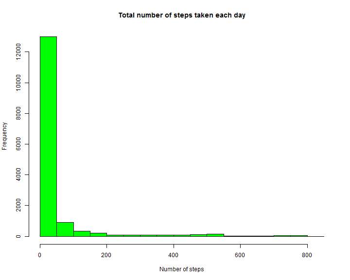
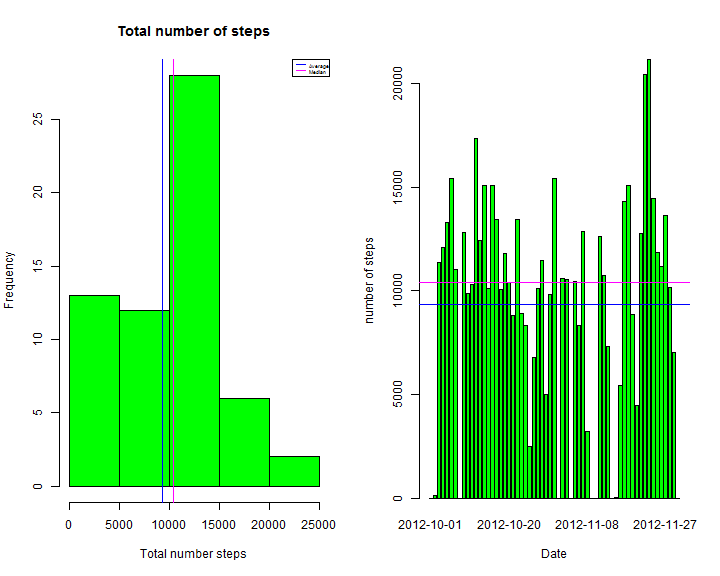
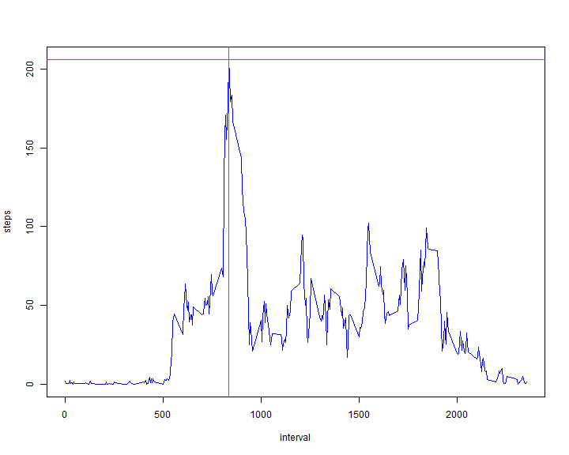
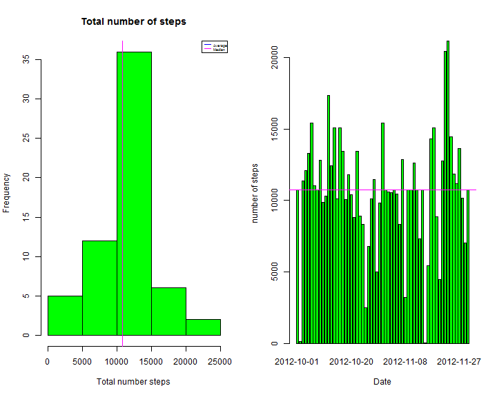
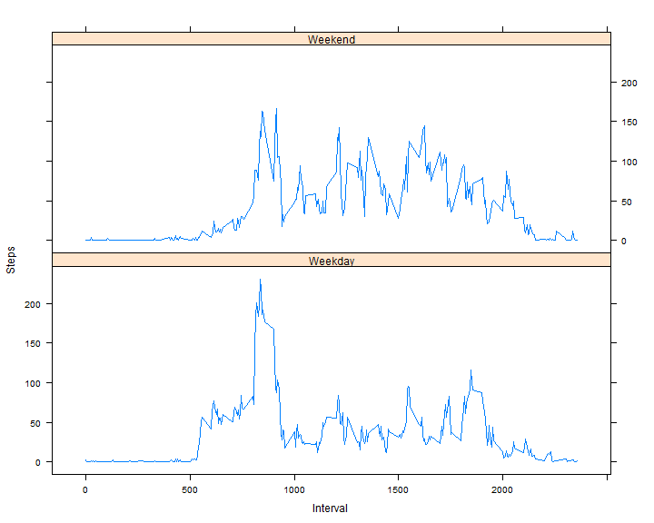

## Activity
========================================================
It is now possible to collect a large amount of data about personal movement using activity monitoring devices such as a Fitbit, Nike Fuelband, or Jawbone Up. These type of devices are part of the "quantified self" movement - a group of enthusiasts who take measurements about themselves regularly to improve their health, to find patterns in their behavior, or because they are tech geeks. But these data remain under-utilized both because the raw data are hard to obtain and there is a lack of statistical methods and software for processing and interpreting the data.

This assignment makes use of data from a personal activity monitoring device. This device collects data at 5 minute intervals through out the day. The data consists of two months of data from an anonymous individual collected during the months of October and November, 2012 and include the number of steps taken in 5 minute intervals each day.

### Loading and preprocessing the data
========================================================

```r
#read activity monitoring data
Sys.setlocale("LC_TIME", "English")
```

```
## [1] "English_United States.1252"
```

```r
activity=read.csv("activity.csv")
hist(activity$steps, col="green", xlab="Number of steps", main="Total number of steps taken each day")
```

 

### What is mean total number of steps taken per day?
=========================================================

```r
# calculate the sum of the steps
totalsteps=tapply(activity$steps, activity$date, sum, na.rm=TRUE)
# mean and median fo the total steps
avgtotsteps=mean(totalsteps, na.rm=TRUE)
mtotsteps=median(totalsteps, na.rm=TRUE)
# assignment is not clear so i provided both
par(mfrow=c(1,2))
#histogram
hist(totalsteps, col="green", xlab="Total number steps", main="Total number of steps")
abline(v=avgtotsteps, col="blue")
abline(v=mtotsteps, col= "magenta")
legend("topright", c("Average", "Median"),cex=0.4, col=c("blue", "magenta"), lty=1)
#barchart
barplot(totalsteps, col="green", xlab="Date", ylab="number of steps")
abline(h=avgtotsteps, col="blue")
abline(h=mtotsteps, col= "magenta")
```

 

```
## [1] "Average=9354.229508"
```

```
## [1] "Median=10395"
```
### What is the average daily activity pattern?
=========================================================

```r
#average per interval
iavg=tapply(activity$steps, factor(activity$interval), mean, na.rm=TRUE)
df.iavg=data.frame(interval=as.numeric(names(iavg)), steps=iavg)
plot(df.iavg, type= "l", col="blue" )
#Which 5-minute interval, on average across all the days in the dataset, contains the maximum number of steps?
abline(h=max(df.iavg$steps),v=df.iavg$interval[which.max(df.iavg$steps)], col="magenta")
```

 


```
## [1] "Number of missing values(NA): 2304"
```

### Imputing missing values
==========================================================
The NA value is replaced with the mean of 5-minutes interval.

```r
#replace the missing values with steps average grouped by interval
#build a lookup table contains this average.
avg.lookup=data.frame(interval=levels(factor(activity$interval)), steps=tapply(activity$steps, factor(activity$interval), mean, na.rm=T))    
#create index of matching between activity interval and the lookup 
imatch<-match(activity[!complete.cases(activity),]$interval, avg.lookup$interval)
activity[!complete.cases(activity),]$steps=avg.lookup[imatch,]$steps 
# create the same steps as for incomplete set
# calculate the sum of the steps
totalsteps=tapply(activity$steps, activity$date, sum, na.rm=TRUE)
# calculate median and mean of total steps
avgtotsteps=mean(totalsteps, na.rm=TRUE)
mtotsteps=median(totalsteps, na.rm=TRUE)
# assignment is not clear so i provided both
par(mfrow=c(1,2))
#histogram
hist(totalsteps, col="green", xlab="Total number steps", main="Total number of steps")
abline(v=avgtotsteps, col="blue")
abline(v=mtotsteps, col= "magenta")
legend("topright", c("Average", "Median"),cex=0.4, col=c("blue", "magenta"), lty=1)
#barchart
barplot(totalsteps, col="green", xlab="Date", ylab="number of steps")
abline(h=avgtotsteps, col="blue")
abline(h=mtotsteps, col= "magenta")
```

 

```
## [1] "Average=10766.188679"
```

```
## [1] "Median=10766.188679"
```
===========================================================================
The impact of imputing missing data with the mean of 5-minutes interval that the mean and median is now the same. The density is now normally distributed.

### Are there differences in activity patterns between weekdays and weekends?
===========================================================================

```r
# Create a new factor variable in the dataset with two levels - "weekday" and "weekend" indicating whether a given date is a weekday or weekend day.
activity$weekday=as.factor(ifelse(weekdays(as.Date(activity$date)) %in% c("Saturday","Sunday"), "Weekend", "Weekday"))
iagg=aggregate(activity$steps, by=list(activity$interval, activity$weekday), FUN=mean)
names(iagg)=c("Interval", "Weekday", "Steps")
library(lattice)
```

```
## Warning: package 'lattice' was built under R version 3.0.3
```

```r
xyplot(Steps~Interval|Weekday, data=iagg, type="l", layout=c(1,2))
```

 
